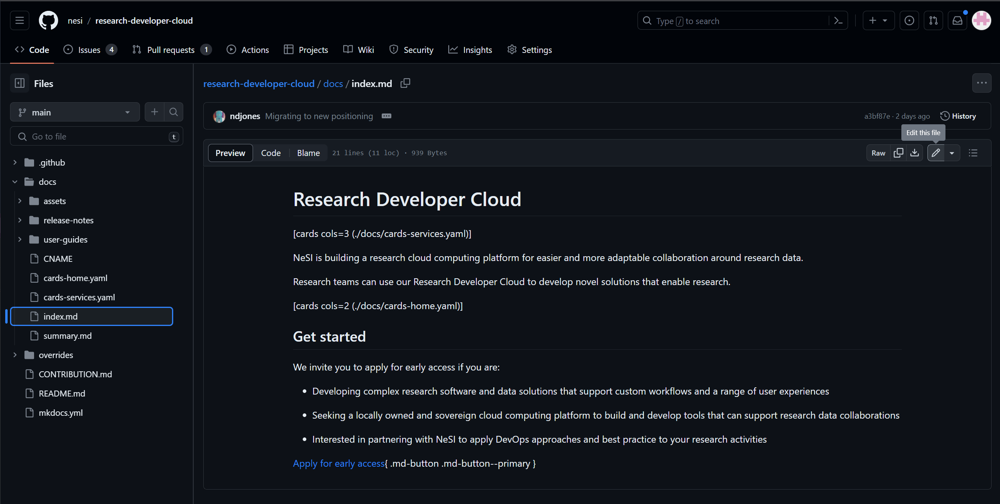
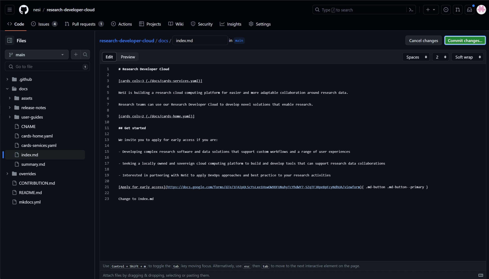

# Contributing

Thanks for contributing to our FlexiHPC User guides repository. Below are ways you can help make the these user guides better.

The easiest way for you to help us is by raising an issue, which will require a GitHub account. For amendments to the documentation, you will need to be familiar with general Git concepts if you'd like to commit substantial changes or even whole new user guides, you will be required to set up the preview environment.

## Raise an issue
The easiest way to help improve our user guides is by raising an issue in our repository at https://github.com/nesi/flexi-docs.

If you find an issues that needs to be resolved, please have a look through the list of existing issues to see whether your issues hasn't already been reported. If it has, or a closely related issues exists, please add your comments to the existing issue.

If your issue isn't already listed, then create a New Issue. Provide details of your suggestion and include the user guide and url to which your suggestion applies. One of our team members will review your suggestion and resolve it if they can. They may contact you if they need some more clarification.

## Making changes

If you would like to make a minor or substantial contribution, you'll need to ensure you have Git and python installed.

## Checking out the code
For minor or substantial edits, you will need to clone the repsitory of the documentation source code. This can be done using the Git command:
```sh
git clone https://github.com/nesi/flexi-docs.git
```
You're now ready to make changes.

### Minor edits via github.com

At https://github.com/nesi/research-developer-cloud, navigate to the markdown document that you wish to update or change.

On the right there is an edit button that looks like a pencil, click on that



Make the required change to the file and click on the `commit changes`



Within the popup provide a commit message and short description. Make sure the `Create a new branch for this commit and start pull request` is selected and give it a branch name.


Click on propose change to submit the change as a PR

### Substantial edits and new user guides

To contribute substantial edits or new user guides, we recommend that you [set up a local development environment](#setting-up-a-local-development-environment), so you can visualise and fine tune your work before you submit it for review.
You'll need some of your `git` skills with this.

- Clone the repo to your local computer using `git clone`.
- Step through the setup routine ([below](#setting-up-a-local-development-environment)) to set up your computer for local previews of your edits.
- Make the edits using your favourite markdown editor.
- Commit your changes to your branch.
- Preview your changes using the local preview server that you set up above.
- When you are happy with your edits or additions, commit your changes to the github repo.
- Create a PR from your branch into `main` on the github site

Please be prepared to answer questions about your edits and make additional commits.

### Setting up a local development environment

Note for windows users, this process will be much easier if you set up [Windows Subsystem for Linux (WSL)](https://docs.microsoft.com/en-us/windows/wsl/install), then the commands below will work within the WSL environment.

### MkDocs Installation

Install mkdocs
```sh
python3 -m pip install mkdocs
```

Install theme and addons
```sh
pip install mkdocs-material mkdocs-glightbox mkdocs-literate-nav neoteroi-mkdocs
```

Once the above items are installed you can then serve the files locally with the below command ensuring you are in the root of the cloned repo

```sh
mkdocs serve
```

Then browse to http://localhost:8000/

### Branch the code

To commit your work for review you will need to branch from `main` and into your own branch.

Using the `git` command below and replacing `BRANCH_NAME` with a name that is easy to understand.

```
git branch BRANCH_NAME
```

**Example:** `git branch 20230815-USER_NAME-Update_Managing_Images`

With the code branched and MkDocs running you should be free to alter and create.

### Markdown styles and references

All markdown references can be found at the [Material for MkDocs](https://squidfunk.github.io/mkdocs-material/reference/) reference page.